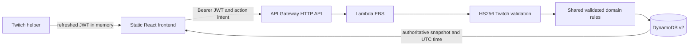

# Architecture and API contract

app/ owns presentation and the current-token client. shared/ owns schemas, catalog values and pure rules. server/ owns authorization, persistence and HTTP adaptation. The frontend never imports the DynamoDB adapter or backend secrets. The local server imports only the in-memory/file adapter and runs on loopback.

The proposed server is separate from the recovered broken Lambda functions. It is not deployed by this code change.

## State and consistency

Each player has a single versioned state item. Wallet is integer aUEC; cargo is integer cSCU (100 cSCU = 1 SCU); all deadlines are Unix epoch milliseconds UTC. TTL alone uses epoch seconds, as required by DynamoDB.

Partition key: `PLAYER#v1#<HMAC-SHA256(stable server identity key, verified persistent Twitch opaque ID)>`. `channel_id` remains a signed authorization/audit context but never selects a save. The HMAC key is separate from rotatable Twitch JWT signing secrets and must be preserved across deployments. [Twitch documentation](https://dev.twitch.tv/docs/extensions/required-technical-background/#opaque-ids) says persistent `U` opaque IDs are stable across sessions and channels; numeric identity sharing is not required for this extension-global save. Real two-channel hosted staging verification remains pending.
Sort keys: `STATE`, `REQUEST#<UUID>`, and reserved `MIGRATION#v1#<source identity/version/content digest>` plus a global `LEGACY#v1#<source digest>` receipt for the prepared but disabled migration writer. Migration receipts have no TTL. The only TTL field is expiresAt on receipts, not player state.

Every mutation has a requestId, expectedRevision and validated action. A transaction writes the next state conditioned on its old revision and a receipt conditioned on its absence. This prevents concurrent double spends and lost updates. Duplicate requests return current authoritative state. A reused ID with different content returns 409. Expired receipts do not permit stale requests to execute because expectedRevision still fails.

Receipts expire after 30 days; a retry older than that may return a revision conflict requiring review. UI disables new actions until an ambiguous request is reconciled. Pending intent is stored in sessionStorage, scoped by Twitch identity, with no token or balance. State is loaded afresh after reopening. Cross-tab writes are protected by the same server revision check.

State items have bounded orders (100), catalog keys and ownership counts (100) to remain within a single-item design. There are no table scans or unbounded player queries. GET /state is a consistent read and initializes a new validated profile via a conditional write if absent. No record can be reset or replaced through the public API. The API therefore never trusts a browser snapshot.

## Endpoints

All routes except OPTIONS require a valid Twitch extension JWT, HTTPS and an allowed browser origin when Origin is present.

- GET /state → { state, serverTime }
- POST /actions → { state, serverTime, replayed? }
- Body: { requestId: UUID, expectedRevision: integer, action: ... }
- Error: { code, message } with HTTP 400, 401, 403, 404, 409, 413 or 503.

Actions:
travel(ship,destination,loadRoc), mine(source,head,crew,extraStations?), finish,
transfer(source,ship,ore,units), refine(source,ore,units,method),
collect(orderId,ship), sell(ship,ore,category,units),
purchase(item,quantity), sellItem(item,quantity).

Price, reward, wallet credit, identity and deadlines are never accepted as action fields. Unknown fields and invalid quantities fail validation.

JWT verification restricts HS256, requires expiry/channel/role/persistent opaque identity, rejects anonymous and external-role tokens, and accepts only configured rotation keys. JWTs never enter logs or persistent storage.

## Failure behavior

Network/503/429 errors retain the original request for retry. A 401 invalidates only the token actually used, so a newer helper token is not discarded by an older response. Definitive validation/conflict errors refresh state and require a reviewed new action. In-flight responses are discarded after identity changes/unmount. UI snapshots never move backwards in revision.

Failed database writes do not publish speculative state. Conditional transaction failures are reconciled; permissions/throttling/infrastructure exceptions become generic 503 responses. Logs contain status and an AWS request ID only, never request bodies or raw exception text.

The file adapter persists one whole state/receipt snapshot via rename and restores memory on persistence failure. It is a single-process development adapter, not a production database.
