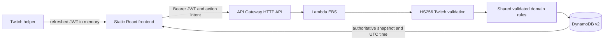

# Architecture and API contract

app/ owns presentation and the current-token client. shared/ owns schemas, catalog values and pure rules. server/ owns authorization, persistence and HTTP adaptation. The frontend never imports the DynamoDB adapter or backend secrets. The local server imports only the in-memory/file adapter and runs on loopback.

Milestones 1 and 1.1 use a dependency-free Canvas scene in `app/rpg/`. `world.ts` owns the local tile map, collision, movement and interaction radius; `canvasEngine.ts` owns drawing, following camera, input, overlay pause and lifecycle. React's `RpgPanel` owns the HUD, transient prompts/toasts, title and touch controls. The active game fills a handheld-shaped surface; React displays Cargo, Refinery, Market, Profile, Travel and classic mining controls as internally scrollable overlays. Terminals open their matching overlay, and the compact pause menu provides the same screens for testing. `MiningActionAdapter` bridges a deposit interaction to the existing `useGame.mutate` authoritative action; the renderer cannot call the API. Walking does not write state. Twitch session handling and all economy actions remain React-owned. See [Milestone 1](dime-2d-rpg-m1.md) for the engine decision, Milestone 1.1 measurements and deferred map-persistence proposal.

The server is separate from the recovered broken Lambda functions. The [isolated SAM staging template](../infra/staging/template.yaml) defines the staging table, EBS Lambda and HTTP API; the approved staging stack was deployed and verified in September 2026. Milestone 1 changes only local frontend source and does not update that stack. `server/migration-dynamo.ts` is a separate, unimported module and cannot be reached through the staging Lambda bundle.

## State and consistency

Each player has a single versioned state item. Wallet is integer aUEC; cargo is integer cSCU (100 cSCU = 1 SCU); all deadlines are Unix epoch milliseconds UTC. TTL alone uses epoch seconds, as required by DynamoDB.

Partition key: `PLAYER#v1#<HMAC-SHA256(stable server identity key, verified persistent Twitch opaque ID)>`. `channel_id` remains a signed authorization/audit context but never selects a save. The HMAC key is separate from rotatable Twitch JWT signing secrets and must be preserved across deployments. [Twitch documentation](https://dev.twitch.tv/docs/extensions/required-technical-background/#opaque-ids) says persistent `U` opaque IDs are stable across sessions and channels; numeric identity sharing is not required for this extension-global save. Real two-channel hosted staging verification remains pending.
Sort keys: `STATE`, `REQUEST#<UUID>`, and reserved `MIGRATION#v1#<source identity/version/content digest>` plus a global `LEGACY#v1#<source digest>` receipt for the prepared but disabled migration writer. Migration receipts have no TTL. The only TTL field is expiresAt on receipts, not player state.

Every mutation has a requestId, expectedRevision and validated action. A transaction writes the next state conditioned on its old revision and a receipt conditioned on its absence. This prevents concurrent double spends and lost updates. Duplicate requests return current authoritative state. A reused ID with different content returns 409. Expired receipts do not permit stale requests to execute because expectedRevision still fails.

Receipts expire after 30 days; a retry older than that may return a revision conflict requiring review. UI disables new actions until an ambiguous request is reconciled. Pending intent is stored in sessionStorage, scoped by Twitch identity, with no token or balance. State is loaded afresh after reopening. Cross-tab writes are protected by the same server revision check.

State items have bounded orders (100), catalog keys and ownership counts (100) to remain within a single-item design. There are no table scans or unbounded player queries. GET /state is a consistent read and initializes a new validated profile via a conditional write if absent. An older save missing a generation marker receives one through a conditional write without changing its gameplay or revision. Only the authenticated, phrase-confirmed `/profile/reset` route can replace the player's own gameplay state; it uses the server's new-player factory and never trusts a browser snapshot.

## Endpoints

All routes except OPTIONS require a valid Twitch extension JWT, HTTPS and an allowed browser origin when Origin is present.

- GET /state → { state, serverTime }
- POST /actions → { state, serverTime, replayed? }
- Body: { requestId: UUID, expectedRevision: integer, action: ... }
- POST /profile/reset → { state, serverTime, replayed? }
- Reset body: { requestId: UUID, expectedRevision: integer, expectedGeneration: UUID, confirmation: "RESET MY DIME PROFILE" }
- Error: { code, message } with HTTP 400, 401, 403, 404, 409, 413 or 503.

The reset route rejects extra fields, including client-supplied identity, keys, state and economy values. It atomically checks revision plus generation, writes canonical initial gameplay at the next revision with a fresh generation, and retains a request receipt for idempotent retry. The HMAC-derived global player association and unexpired technical receipts remain. This is not a privacy-deletion endpoint; see [Milestone 2.3](dime-2d-rpg-m23-reset.md).

Actions:
travel(ship,destination,loadRoc), mine(source,head,crew,extraStations?), finish,
transfer(source,ship,ore,units), refine(source,ore,units,method),
collect(orderId,ship), sell(ship,ore,category,units),
purchase(item,quantity), sellItem(item,quantity).

Price, reward, wallet credit, identity and deadlines are never accepted as action fields. Unknown fields and invalid quantities fail validation.

JWT verification restricts HS256, requires expiry/channel/role/persistent opaque identity, rejects anonymous and external-role tokens, and accepts only configured rotation keys. JWTs never enter logs or persistent storage.

## Failure behavior

Network/503/429 errors retain the original request for retry. A 401 invalidates only the token actually used, so a newer helper token is not discarded by an older response. Definitive validation/conflict errors refresh state and require a reviewed new action. In-flight responses are discarded after identity changes/unmount. UI snapshots never move backwards in revision.

Failed database writes do not publish speculative state. Conditional transaction failures are reconciled; permissions/throttling/infrastructure exceptions become generic 503 responses. Logs contain status and an AWS request ID only, never request bodies or raw exception text.

The file adapter persists one whole state/receipt snapshot via rename and restores memory on persistence failure. It is a single-process development adapter, not a production database.

# Milestone 2 local chapter

The First Shift adds an optional, backward-compatible quest field and a server-derived `firstShift` action sequence to the v2 global save. Its transition table, tutorial economy, mining interaction, and release limits are documented in [dime-2d-rpg-m2.md](dime-2d-rpg-m2.md). This branch is not deployed; the new frontend requires a matching Lambda bundle in a future reviewed release.

## Milestone 3 draft world/action contract

The uncommitted Milestone 3 work adds `world` to the global save, with a stable zone ID, entry, deterministic node seed reference, sparse node exceptions, scanner history, active mining session, active ROC checkpoint and fractional cargo remainders. Older inventory and cargo numbers remain whole cSCU. A physical pickup is represented in integer minor units (100 units per cSCU); `world.minorRemainders` contains only the 0–99 unit carry, so a legacy 4 cSCU remains 400 units when combined. New and reset profiles start at `ARC-L1` / `ARC_L1_START`. The renderer must select the zone from the server snapshot and show recovery for unknown or mismatched location/zone pairs.

The existing authenticated `POST /actions` route accepts `enterZone(zone)`, `scanZone`, `analyzeNode(nodeId)`, `beginFracture(nodeId,source)`, `completeFracture(nodeId)`, `cancelFracture(nodeId)`, `collectPiece(nodeId,pieceId)`, `retrieveRoc`, `enterRoc(occupied)` and `stowRoc`. No new route or IAM permission is proposed. The server chooses node mineral, properties, yield, fragment IDs and prices. Browser charge simulation cannot prove physical input, so the server also checks the persisted session and minimum elapsed duration. The same revision, save-generation and request-receipt guards cover all actions. See [Milestone 3](dime-2d-rpg-m3-world-mining.md) for formulas and known incomplete routes; this draft is not a release contract yet.

# Milestone 4.1 original-content boundary (proposed)

The proposed handler keeps the same authenticated global Twitch identity and DynamoDB state/receipt transaction. Original-universe operations use `/v4/state`, `/v4/content/preview`, `/v4/content/convert`, `/v4/actions`, and `/v4/profile/reset`. Schema 3 uses stable opaque content IDs, content version 4, save format 3, and integer mineral units where one unit is 0.01 cSCU. The server owns node parameters, yields, pieces, prices, processing, travel destinations, arrival points, revision and save generation.

Legacy endpoints remain temporarily available only to unconverted Milestone 3 clients. Conversion is an explicit guarded transaction; after it, the version-3 snapshot is served only by `/v4`. No OAuth or internal-account linking is part of Milestone 4.1.
