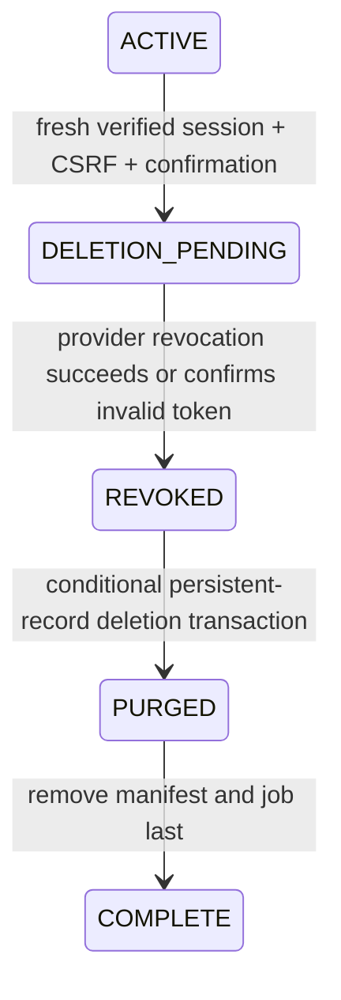

# Bounded account manifest and verified deletion — preparation only

This review supersedes the lifecycle/deletion limitation in the previous shared-save review. **Do not execute the review change set or publish the website.** New linking, unlinking and deletion initiation remain disabled in the proposed configuration. Capability-guarded resumption of an already verified deletion remains available even if new linking is disabled. No real records were read or changed during preparation.

## Identity and manifest bounds

One random internal account owns one canonical player partition, at most one OAuth identity and at most one Extension identity. Unlink reserves that same Extension identity for verified relinking; attaching a different identity requires a separately reviewed feature. Existing Extension saves stay in their original partition, including generation and receipts. Linking never copies gameplay data, and two distinct existing saves always conflict.

`AUTH#v1#manifest:<account UUID> / RECORD` stores an encrypted, strict version-1 manifest:

- `account`: random internal UUID.
- `player`: canonical PLAYER or ACCOUNT partition reference.
- `oauth`: existing domain-separated identity HMAC reference.
- `extension` **or** `detached`: at most one Extension identity HMAC reference; mutually exclusive.
- `status`: ACTIVE, DELETION_PENDING or PURGED.
- `temporary`: a fixed five-entry class tuple (SESSION, LINK_INTENT, LINK_OUTCOME, REQUEST_RECEIPT, DELETION_RECEIPT), never individual record IDs. Anonymous pre-login records have no account association and expire in five minutes.

Unknown fields, malformed identifiers and manifests over **1,024 serialized bytes** are rejected. There are **seven base persistent-reference slots**, plus two active Extension slots or one detached recovery slot: **nine maximum**. References are derived by code, not arbitrary caller-provided keys. No token, secret, gameplay snapshot, wallet, inventory, username, email or profile field belongs in the manifest.

### Complete persistent record inventory

| Record class                                                              | Logical reference derived from manifest | Storage / purpose                                                                  |
| ------------------------------------------------------------------------- | --------------------------------------- | ---------------------------------------------------------------------------------- |
| Manifest                                                                  | `manifest:A`                            | AUTH; this inventory, removed last                                                 |
| Internal account / link association                                       | `account:A`                             | AUTH; canonical player and identity pointers                                       |
| OAuth mapping / authentication credential                                 | `oauth:S`                               | AUTH; one account pointer, credential epoch and bounded refresh lease              |
| Provider grant                                                            | `grant:S`                               | AUTH; normally temporary; explicitly retained while deletion revocation is pending |
| Canonical gameplay                                                        | `state:P`                               | Existing `pk=P, sk=STATE`; never copied during linking                             |
| Canonical ownership / deletion barrier                                    | `control:player:P`                      | CONTROL; account UUID and ACTIVE/DELETION_PENDING status; no credentials           |
| Resumable deletion job                                                    | `deletion:A`                            | AUTH; capability digest and durable phase; no save or tokens                       |
| Active Extension account mapping                                          | `extension:E`                           | AUTH; one owning account pointer                                                   |
| Active Extension canonical binding                                        | `binding:E`                             | Existing BINDING namespace; player pointer, epoch, status                          |
| Detached identity reservation (instead of the preceding two active slots) | `control:reservation:E`                 | CONTROL; one reserved account pointer and DETACHED status                          |

AUTH records remain AES-GCM encrypted with record-key authenticated context. CONTROL/BINDING are routing metadata readable by gameplay without granting access to OAuth encryption keys. No new DynamoDB index, key schema, table, billing, encryption, TTL setting or PITR setting is proposed.

## Atomic changes and conflict protection

OAuth account creation writes account, credential, manifest and canonical ownership together. A callback cannot assign a second OAuth identity to an existing manifest. Callback rotation uses a bounded credential lease to prevent overwriting a concurrent refresh, and retires the previous stored access token when it differs from the newly issued one. A rejected callback issues no gameplay session and attempts to revoke the newly exchanged token.

Successful linking conditions the complete read set: verified session/credential epoch, one-use intent, web revision/generation, both applicable states, binding, reservation, ownership and manifest. It atomically updates account/Extension pointers, binding, ownership and manifest, consumes the intent and writes a **24-hour** outcome. Conflict consumes only the intent and writes its temporary outcome; neither save nor any manifest reference changes. Original-intent replay validates current ownership and binding epoch and performs no repeated mutation.

Unlink requires a verified web session issued within five minutes, exact origin, CSRF and explicit `UNLINK_EXTENSION` confirmation. It atomically removes the Extension mapping and binding, removes the manifest's active Extension reference, and records the single detached reservation instead. Gameplay remains in P. The reservation blocks Extension fallback save creation. Prior intents/session epochs are invalidated. Verified relinking of that same identity removes the reservation and restores both live mappings atomically. There is no automatic merge or identity substitution.

Gameplay reset changes STATE/generation and its ordinary request receipt only; it does not change the manifest or identity mappings. Every linked web/Extension state read, receipt replay and commit checks ownership/deletion barriers in the same transaction. This also prevents an in-flight request authorized before deletion from committing afterward.

## Verified deletion state machine

1. **Verify and mark:** `POST /auth/delete/intent` requires a valid web session issued within five minutes, exact origin, CSRF, literal `DELETE_ACCOUNT` confirmation and a random 256-bit continuation capability. The account, manifest and ownership barrier become DELETION_PENDING atomically. All normal session creation, actions, resets, linking and receipt replays stop. The single encrypted provider grant loses its TTL until revocation completes, so a provider outage cannot silently erase the material needed for retry. No provider token is placed in the manifest or deletion job.
2. **Revoke:** `POST /auth/delete/resume` authenticates the deletion capability and advances one phase. It revokes the stored access token through Twitch. Only success or Twitch's documented `400 / Invalid token` response counts as completion. Network failures, 404, unrelated 400 and 5xx leave the durable pending job and grant intact. After success, a transaction deletes the grant and records REVOKED. Refresh material is destroyed locally; no claim is made that Twitch's documented access-token endpoint revokes the user's entire provider-side application authorization.
3. **Purge:** one transaction revalidates manifest, ownership, account, OAuth and Extension/reservation pointers. It deletes the account, live Extension mapping/binding, grant and canonical STATE, and replaces identity/ownership routing records with minimal suppression markers. It writes PURGED to the job and manifest. A malformed manifest cannot redirect deletion to another account's save.
4. **Finish:** a separate final transaction deletes the manifest and job and writes a 24-hour completion receipt keyed by a hash of account-plus-capability. The manifest survives every destructive step until the durable PURGED checkpoint. Retrying a completed operation returns COMPLETE within that receipt's validity window.

Each persistent deletion phase is bounded and fits a DynamoDB transaction; no Scan, Query or batch enumeration is used. DynamoDB supports up to 100 actions and 4 MB per transaction; the fixed inventory is far smaller. [AWS transaction limits](https://docs.aws.amazon.com/amazondynamodb/latest/APIReference/API_TransactWriteItems.html)

A Secure, HttpOnly, host-only, SameSite=Strict continuation cookie permits resumption after refresh without a gameplay session. Its maximum age is 35 days and it is cleared on completion. The capability never goes in a URL, log or frontend storage. Explicit capability resumption is supported for lost-response retries. If the owner loses every continuation proof, recovery requires a separately verified support procedure; the system must not unblock or recreate the account automatically. Pending jobs do not silently expire.

There is no background scan or deletion sweeper. Completion normally requires the confirmation request and three successful resume requests. Provider/network outages pause completion indefinitely in a blocked state; elapsed time is not deletion success. The current change prepares the backend protocol; production account-settings UI and real-provider end-to-end verification remain website release gates.

## Exact retention and temporary classes

The manifest identifies the following bounded record classes rather than retaining every temporary ID. Authentication, account existence and generation/epoch checks invalidate them at deletion; their existing expiry bounds govern physical TTL eligibility.

| Class                                                        | Maximum lifetime / TTL eligibility                               | Deletion behavior                                                                          |
| ------------------------------------------------------------ | ---------------------------------------------------------------- | ------------------------------------------------------------------------------------------ |
| OAuth login state, browser binding and nonce                 | 5 minutes                                                        | One-use; no account is created before provider verification                                |
| Authorization code                                           | Never stored                                                     | Exchanged server-side; absent from completed callback URL                                  |
| Session and its CSRF value                                   | 8 hours absolute, 30 minutes idle                                | Account barrier immediately blocks use; physical item remains TTL-eligible at its deadline |
| Stored active provider grant                                 | 8 hours, bounded by session absolute expiry                      | Held without TTL only while revocation is pending; explicitly deleted after revocation     |
| Refresh lease                                                | 60 seconds inside the one credential record                      | Rotation/deletion checks prevent stale lease writes                                        |
| Link intent                                                  | 5 minutes                                                        | One-use; account barrier blocks pending intents                                            |
| Successful or failed link outcome                            | 24 hours                                                         | Expiry is checked even before DynamoDB removes the item; never a persistent orphan         |
| Gameplay/action/reset/conversion receipts                    | Existing 30 days                                                 | Account barrier and generation checks prevent replay; no receipt ID list accumulates       |
| Deletion completion receipt                                  | 24 hours                                                         | Contains only completion and expiry, no account/profile pointer in payload                 |
| Continuation cookie                                          | 35 days maximum                                                  | HttpOnly; cleared after completion                                                         |
| Deletion suppression markers                                 | 35 days TTL eligibility                                          | Payload contains only `deleted: true` and expiry                                           |
| Manifest, account mappings, ownership and unlink reservation | Until unlink/deletion transitions explicitly remove/replace them | Exact-key inventory; no reliance on retention for persistent deletion                      |
| Pending deletion job and retained revocation grant           | Until successful completion                                      | No automatic expiry that could strand deletion or reopen gameplay                          |

Suppression markers use existing HMAC/random routing keys, retain no raw identity, account pointer, save, token or profile payload, and prevent pre-deletion routing and callback replay during the suppression window. Their keys are **pseudonymous, not a claim of mathematical anonymity**. Markers may remain longer than 35 days until TTL removes them; they continue to deny access while present. A new account after the suppression horizon requires fresh authentication and receives a new random generation; old v4 action generations cannot mutate it.

DynamoDB TTL is asynchronous, so eligibility is not a promise of immediate physical removal. Temporary encrypted sessions/outcomes and technical receipts may remain until TTL removes them, but cannot authorize access to a deleted account. [AWS TTL behavior](https://docs.aws.amazon.com/amazondynamodb/latest/developerguide/TTL.html)

PITR/backups remain unchanged. Do not restore a pre-deletion backup directly to serving traffic: reapply verified deletion suppression before enabling access. If deletion evidence needed for a restore is unavailable, keep the restored system offline. This candidate neither exports player data nor automates backup restoration.

## API and IAM review

The separate web-auth Lambda gains three route-scoped methods: POST `/auth/unlink`, `/auth/delete/intent`, `/auth/delete/resume`. All eight existing gameplay routes and the eleven previously proposed web routes remain structurally unchanged. New unlink/deletion initiation is disabled while AccountLinkingMode is DISABLED. Resumption requires an existing verified job and its capability and remains available when new operations are disabled.

The gameplay role adds CONTROL to its already-proposed ConditionCheckItem prefix list, retaining its original GetItem/PutItem and own-log statements unchanged. It receives no DeleteItem or OAuth credentials.

The web-auth role's GetItem/PutItem/ConditionCheckItem statement adds CONTROL. Its DeleteItem statement expands from AUTH-only to the exact staging table's AUTH/BINDING/PLAYER/ACCOUNT/CONTROL prefixes, with ForAllValues LeadingKeys and a non-null guard. IAM cannot express this application's manifest ownership relationship; the service's conditional transactions enforce it. The deletion grant covers those partitions, including receipt sort keys, even though application deletion code targets only the reviewed persistent records. This expansion requires explicit review before execution.

No role gains Scan, Query, UpdateItem, DeleteTable, table configuration operations or runtime secret-read permissions. Source-based IAM analysis was rerun with telemetry disabled. AWS custom-policy simulation passed 16 synthetic cases / 46 action decisions, including prefix allows, missing/mixed/unrelated context denies, wrong-table denies, no gameplay deletion, and no scans/queries/administration. These simulations are not deployed data-plane IAM tests.

## Security, privacy and rollback disposition

- The persistent outcome enumeration blocker is resolved: persistent records have fixed manifest references; intent outcomes are explicitly temporary with checked expiry.
- Two-save conflicts, unlink/relink and resets cannot add a second identity or change canonical ownership silently.
- Deletion cannot be cancelled by ordinary login, timeout, reset or request replay. Failed provider calls do not advance the job.
- No self-service request can supply arbitrary record keys to the deletion worker.
- Gameplay reset, unlink and account deletion are separate operations with separate confirmations and effects.
- Do not roll back to a writer that ignores manifests, reservations or deletion barriers after any lifecycle operation might have occurred. Disabling new linking must not disable enforcement of existing ownership/deletion barriers. Retain compatible resume capability until pending deletions finish.
- Do not delete jobs/manifests to recover from errors or restore old state snapshots as rollback.
- Published privacy text must explain the exact retention table, delayed physical TTL removal, retained blocked deletion jobs, provider revocation limitations and PITR restore precautions before website release. The live `/privacy` object is unchanged by this preparation.
- The replacement change-set evidence report records resource operations, pinned artifacts and validation. No execution is authorized here.

[Twitch access-token revocation contract](https://dev.twitch.tv/docs/authentication/revoke-tokens/)
