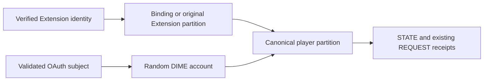

# Shared-save identity review — PREPARATION ONLY

## Scope and deployment gate

Prepare a separate web-auth Lambda and the smallest canonical-routing integration in the existing gameplay Lambda. **Do not execute the change set, enable linking, publish website objects, or invalidate CloudFront during this review.** The separate change-set report records actual artifact identities and CloudFormation operations. Existing gameplay resources, eight routes, table configuration, conversion ENABLED and empty tester tags must be preserved.

The old combined-handler generator in `infra/web/prepare_review.py` is historical and is not this candidate. Use `prepare_shared_review.py` and the shared source/processed Guard rules. No real player records were read, scanned, changed, copied, reset or migrated while preparing this review.

## Identity state model

- **Extension identity E:** existing domain-separated HMAC of verified Twitch Extension opaque identity using the unchanged Extension identity key. Existing physical player partition remains `PLAYER#v1#<digest>`.
- **OAuth subject S:** separately domain-separated HMAC of the validated provider subject using the independent web identity key. Never equate the numeric OAuth subject with the Extension opaque identity.
- **DIME account A:** random UUID, created once through a conditional OAuth-subject mapping. Initial web partition is `ACCOUNT#v1#<uuid>`.
- **Canonical player P:** the physical partition holding the one gameplay state and its existing receipts. A link changes routing pointers, never copies or rewrites state or receipts.
- **Binding B(E):** `{player:P, epoch:randomUUID, status:ACTIVE|DETACHED}`. No OAuth token, cookie or raw provider identifier. Persistent, no TTL. DETACHED preserves P instead of falling back to a new Extension partition.
- **Web account:** encrypted `{id, player, established, oauth, extension?, suspended?}`. The `established` flag is an additional conservative conflict guard; actual existence of both distinct saves is sufficient to reject linking even if both are pristine.

Unbound Extension requests resolve E → E. Bound requests resolve E → P. The gameplay handler authenticates with its existing credentials, checks the binding transactionally and runs its existing legacy/v4 APIs. It receives no OAuth client secret, web identity key or auth encryption key. Its only new environment variable is the non-secret linking-availability flag.

Web sign-in creates an account/session, **not a gameplay save**. `/auth/session` returns a profile-existence boolean. The new web gate offers linking before requesting `/api/v4/state`; creating a new web profile requires an explicit choice. Existing profiles continue loading normally. This avoids silently creating a second save before the user can link.

## Conflict and operation table

| Situation                                                                         | Result                                                                                                                     | Gameplay effect                                                                                                                           |
| --------------------------------------------------------------------------------- | -------------------------------------------------------------------------------------------------------------------------- | ----------------------------------------------------------------------------------------------------------------------------------------- |
| New OAuth identity, no Extension link                                             | Create one random account and rotated session; show profile choice                                                         | No save until user chooses web gameplay                                                                                                   |
| Existing Extension save, web has no save                                          | Independently verify both sides; point web account and binding to existing E partition                                     | Preserve all fields, revision, generation, wallet, inventory, equipment, fleet, quests, position, mining state and receipts byte-for-byte |
| Existing web save, Extension has no save                                          | Bind Extension to existing web P                                                                                           | No copy, duplicate reward, reset or second save                                                                                           |
| Neither has a save                                                                | Bind both to web account P; first normal v4 load conditionally creates one profile                                         | One creation winner under transaction conditions                                                                                          |
| Already linked to same account/P                                                  | A fresh intent may confirm the same binding; rotate web credential epoch                                                   | No gameplay mutation                                                                                                                      |
| Both distinct partitions have any save                                            | `409 LINK_CONFLICT`, explicit support message; consume intent and persist conflict outcome                                 | Preserve both; never automatically choose, merge or discard                                                                               |
| Different existing account, detached binding, or conflicting Extension assignment | `409 LINK_CONFLICT`                                                                                                        | Preserve bindings and saves for support                                                                                                   |
| Web save revision/generation changed since intent                                 | `409 LINK_STALE`; require refreshed state and a new intent                                                                 | No linking or gameplay mutation                                                                                                           |
| Lost response / original intent replay                                            | Independently verify Extension again; return persistent outcome only for matching identity and still-current binding epoch | No repeated link mutation or reward                                                                                                       |
| Another Extension replays intent                                                  | Reject generically                                                                                                         | No account/identity disclosure or mutation                                                                                                |
| Repeated OAuth callback                                                           | Consumed state rejects; a later fresh login resolves existing subject → account                                            | No duplicate account or reward                                                                                                            |
| Gameplay reset after linking                                                      | Existing revision/generation-guarded reset operates on P                                                                   | New generation at same P; binding unchanged; old-generation actions fail                                                                  |
| Unlink                                                                            | No self-service endpoint is implemented; reject unsupported calls                                                          | Never deletes state or falls back to a new save                                                                                           |
| Account deletion                                                                  | Separate verified support workflow; not implemented or executable here                                                     | Logout/reset/link do not delete an account or gameplay data                                                                               |

Support conflict resolution is deliberately not an automatic merge. It requires separately verified ownership and an explicit, separately reviewed choice of access to preserved profiles. No resolution writer is included in this candidate.

## Exact physical records

The existing table uses `pk`, `sk`. No index, schema, TTL attribute, billing, encryption, PITR or retention-policy change is proposed.

| Logical record             | Physical key                                       | Payload / retention                                                                                                                                            |
| -------------------------- | -------------------------------------------------- | -------------------------------------------------------------------------------------------------------------------------------------------------------------- |
| `state:P`                  | `pk=P`, `sk=STATE`                                 | Existing `state` and numeric `revision`; save generation stays inside state; no TTL                                                                            |
| `receipt:R:P`              | `pk=P`, `sk=REQUEST#R`                             | Existing fingerprint and expiresAt; existing receipts remain readable without a revision attribute; new adapter receipts may also carry a random revision      |
| `binding:E`                | `pk=BINDING#v1#E`, `sk=RECORD`                     | Plain non-secret routing object and random revision; no TTL; no full save or tokens                                                                            |
| `login:hash(state)`        | `pk=AUTH#v1#login:hash(state)`, `sk=RECORD`        | Encrypted browser digest, nonce, five-minute expiry; TTL                                                                                                       |
| `oauth:S`                  | `pk=AUTH#v1#oauth:S`, `sk=RECORD`                  | Encrypted account pointer, credential epoch and optional refresh lease; persistent mapping                                                                     |
| `account:A`                | `pk=AUTH#v1#account:A`, `sk=RECORD`                | Encrypted account model above; persistent                                                                                                                      |
| `grant:S`                  | `pk=AUTH#v1#grant:S`, `sk=RECORD`                  | Encrypted provider tokens, epoch, expiry; TTL bounded by eight-hour session lifetime                                                                           |
| `session:hash(cookie)`     | `pk=AUTH#v1#session:hash(cookie)`, `sk=RECORD`     | Encrypted account/subject/CSRF/epoch/idle/absolute expiry and optional intent digest; TTL                                                                      |
| `extension:E`              | `pk=AUTH#v1#extension:E`, `sk=RECORD`              | Encrypted owning-account pointer; persistent, written atomically with binding                                                                                  |
| `link:hash(intent)`        | `pk=AUTH#v1#link:hash(intent)`, `sk=RECORD`        | Encrypted account, session, epoch, P, observed web revision/generation and five-minute expiry; TTL                                                             |
| `link-result:hash(intent)` | `pk=AUTH#v1#link-result:hash(intent)`, `sk=RECORD` | Encrypted account/E/P, LINKED or CONFLICT, binding epoch if successful, observed web/Extension revision and generation; persistent replay record; no full save |

All AUTH payloads use AES-256-GCM with record-key authenticated context and random IV. Keys and tokens remain server-side. Binding metadata is intentionally readable by gameplay without giving that Lambda decryption credentials. Derived identity keys remain sensitive operational metadata and must not be logged or exposed externally.

## Transactions and conditions

Every adapter lookup is exact-key, strongly consistent. Each transaction accumulates its complete read set and performs a single `TransactWriteItems` with one Put/Delete/ConditionCheck per physical item. No Scan, Query or batch export exists. At most 90 read items are allowed; these flows use a small bounded subset.

- Missing item: `attribute_not_exists(pk)`.
- Existing versioned item: `revision = :observedVersion`.
- Existing legacy receipt without revision: `attribute_exists(pk) AND attribute_not_exists(revision)`.
- Existing STATE adds `state.saveGeneration = :observedGeneration`, or `attribute_not_exists(state.saveGeneration)` for a legacy save. This prevents a reset returning to the same revision from defeating a transaction's read guard.
- Read-only transactions use ConditionCheck for the complete read set before returning data. No stale binding may authorize a state or receipt read after its epoch changes.
- Gameplay commit checks canonical P, binding epoch/status, expected revision, expected generation and absence of the original request receipt. STATE and receipt write atomically. Legacy receipt shape and existing conversion service semantics remain intact.
- Successful link reads current intent/result, session, credential, grant, web account, Extension-account mapping, binding and both applicable STATE records. It validates independently authenticated Extension identity, live web epoch and intent expiry, plus captured web revision/generation. It atomically consumes intent, updates account/mapping/binding, writes durable outcome, rotates credential epoch and deletes grant. **Neither STATE nor any gameplay receipt is written.**
- Conflict commits only intent consumption/outcome under the same read conditions; no binding or save changes.
- Replay reads outcome plus current account/binding and requires the matching Extension and binding epoch/status. A reset does not repeat linking; a detach/rebind invalidates the old successful receipt.
- Concurrent conditional failure yields a recoverable error, never a partial mutation. Original request/intent identifiers must be retained for retry after uncertain network outcomes.

OAuth callback state consumption and provider code exchange cannot be one DynamoDB transaction. A failure between them requires a fresh login, not reuse of the callback; conditional subject/account creation prevents duplicates. Credential refresh uses a bounded lease and epoch checks; callback/link/logout rotation invalidates older sessions.

## Security and operational review

Cookies remain Secure, HttpOnly, host-only `__Host-`, SameSite=Lax; web mutations require exact origin and CSRF header. OAuth state and nonce, issuer/audience/expiry and provider validation remain enforced. Completed callback URLs contain no code or token. Only `openid` is requested. Provider failures remain generic; link conflict/stale codes expose no identity or save fields.

Only web-auth receives the supplied public OAuth client ID and runtime secret references. All three supplied secret ARNs were verified through metadata to exist with AWSCURRENT versions and no pending deletion. Values and encoding were not retrieved or validated by the agent. Runtime configuration and real provider consent remain future deployment gates.

IAM static analysis was run with telemetry disabled. Its broad table/key resources and replication/UpdateItem/KMS suggestions are not applied. The reviewed candidate retains the existing gameplay role and adds only scoped `dynamodb:ConditionCheckItem` for PLAYER/ACCOUNT/BINDING partitions. The separate web role gets GetItem/PutItem/ConditionCheckItem on AUTH/BINDING/PLAYER/ACCOUNT prefixes and DeleteItem only on AUTH prefixes, all on the exact existing table. Each multi-value LeadingKeys condition includes a non-null guard. No role receives Scan, Query, table administration or secret-reading runtime permissions. CloudFormation resolves existing dynamic references during a separately authorized deployment.

Remaining release gates, not waived by local tests:

1. Owner review and explicit execution authorization for the exact processed change set.
2. Real IAM/transaction validation with approved synthetic identities; no real-player inspection.
3. Deploy binding-aware gameplay while linking stays DISABLED, wait UPDATE_COMPLETE, verify code/configuration/routes, and drain all prior invocations for longer than the old 10-second timeout.
4. Verify separate OAuth runtime configuration, real callback/consent, refresh/revocation, cookie/CSRF/session behavior and synthetic linking conflicts/retries through the deployed infrastructure.
5. Prepare and review a separate activation change set enabling linking in both Lambdas only after all writers are verified binding-aware. Never roll only one writer back to the old implementation after linking.
6. Complete privacy disclosure, website backups, CloudFront TLS/CSP/routing and conditional publication review. None is included in this backend preparation.

Unlink and account deletion are **design-only support workflows**, not release-ready endpoints. No unlink/deletion route or permission to delete gameplay records is included. A future unlink must verify both sides or a reviewed recovery procedure, atomically mark B DETACHED while retaining P, suspend the old OAuth account access, rotate epochs and retain a tombstone preventing fresh-login account recreation. Old link outcomes cannot reactivate a detached binding. Deletion requires a separately authorized identity-scoped process and restore tombstones, never a gameplay reset or table scan. Do not advertise these as available self-service features.

## Privacy and migration review

No migration is performed. Existing Extension HMAC identity, partition keys, state, quantities, generation, mining fragments and technical receipts remain where they are. The resolver is additive and deployed with linking disabled. No player inventory or identity is enumerated to decide rollout eligibility.

Before website publication, the privacy disclosure must cover separate OAuth credentials, encrypted grants and auth records, hashed state/session/link capabilities, random DIME account identifiers, canonical binding metadata, persistent mappings/link results, session/intent TTL eligibility, support conflict handling and account recovery. TTL eligibility does not promise immediate removal. Persistent link results do not contain full saves and cannot simply be described as the old gameplay-receipt TTL policy. Retain verified contact, processing, encryption, logs, PITR and deletion language; `/privacy` remains untouched in this task.

## Rollback matrix

| Rollback point                                                             | Safe behavior                                                                                                                                                                                 |
| -------------------------------------------------------------------------- | --------------------------------------------------------------------------------------------------------------------------------------------------------------------------------------------- |
| Candidate not executed                                                     | Delete/correct only the unexecuted change set if later authorized; live deployment unchanged                                                                                                  |
| New backend deployed, linking never enabled and no binding writes occurred | Disable web entry points; reviewed rollback to prior gameplay artifact may be considered only with evidence no bindings were created; no table changes                                        |
| Any account linked or possibly linked                                      | **Do not restore the pre-binding gameplay Lambda.** Keep canonical resolution and guarded writes; disable new linking, roll web UI/auth code back only to a binding-schema-compatible version |
| OAuth unavailable                                                          | Disable web sign-in/new links; Extension continues resolving its existing canonical P; preserve encrypted records and keys                                                                    |
| Detached account                                                           | Retain binding target and tombstone; never fall back to E and create a second save                                                                                                            |
| Reset occurred                                                             | Never restore a save snapshot or reverse generation. Old action replay must stay generation-protected                                                                                         |

There is no safe general rollback from linked state to an unaware writer without a separately reviewed identity-specific recovery plan. Never scan production data to prove rollback safety and never merge or delete saves as rollback. Preserve this candidate's binding-aware gameplay artifact as the minimum future rollback baseline after activation.
